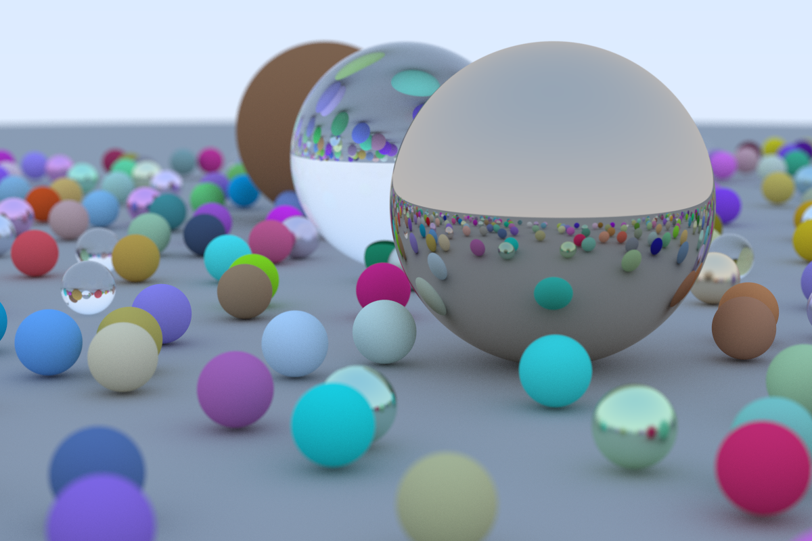

# Ray Tracing in One Weekend (in Rust)

This is a Rust implementation of [*Ray Tracing in One Weekend*](https://raytracing.github.io/v3/books/RayTracingInOneWeekend.html). It was implemeneted based on version 3.2.3 of the book. Implementation should be pretty close to the C++ implementation of the book but there are some differences due to the language differences.

The [vec3 class](https://raytracing.github.io/v3/books/RayTracingInOneWeekend.html#thevec3class) was not implemented in favor of the [Vector3](https://docs.rs/nalgebra/latest/nalgebra/base/type.Vector3.html) class of [nalgebra](https://docs.rs/nalgebra/latest/nalgebra/).

There is a commit for every chapter that contains code snippets. Not every commit contains compilable code because the chapters sometimes do not produce compilable code.

Furthermore the process of rendering has been parallelized and the output image was generated as PNG using the [image](https://docs.rs/image/latest/image/index.html) crate.

## Disclaimer

I'm quite new to Rust. I was looking for a project which I could adopt to Rust to get to know the language better. So there might be better approaches for this. If you have any improvement proposals please let me know!
